# StructText 🗂️📑 – Synthetic Table-to-Text **Dataset Builder**, **Baseline Generator** & **Evaluation Toolkit**

[](https://huggingface.co/datasets/ibm-research/struct-text)
[](LICENSE)

> **Paper** *StructText: A Synthetic Table-to-Text Approach for Benchmark Generation with Multi-Dimensional Evaluation* (TaDA @ VLDB 2025)


Large language models can verbalise structured data with impressive factual fidelity, yet the resulting narratives often bury key facts in prose that defeats downstream machine extraction. **StructText** bridges this gap by building a benchmark that starts with *trusted tables* and scores every generated passage on four dimensions:

* **Factuality** – does the text faithfully reflect the source cells?
* **Hallucination** – does it introduce facts that never existed?
* **Coherence** – is the narrative well-structured and easy to read?
* **Numeric & Temporal accuracy** – are figures and dates reproduced exactly?

### Two-stage "plan–execute" pipeline

1. **Plan.** An LLM samples the table and proposes 1–5 semantically coherent *report types*—each is just a list of columns that belong together.
2. **Execute.** For every row × report-type pair, the model writes a short passage that mentions *only* those columns.

### Baseline text→table extractor

To close the loop, we ship a lightweight baseline that reverses the process:

* **Step 1 – Column selection**: an LLM identifies which columns are mentioned in the passage.
* **Step 2 – Cell extraction**: it pulls the corresponding key : value pairs for each row.

The extractor is evaluated with both exact-match and semantic-similarity scoring, giving the community a clear baseline to surpass.


---

## End-to-end flow

```mermaid
flowchart LR
    A[📊 Tables] --> B[🤖 Report Planner]
    B --> C[📝 LLM Generator]
    C --> D[✅ 4-Axis Validator]
    D --> E[🔍 Text→Table Baseline]
    E --> F[📈 Metrics]

    B -.-> B1[1-5 column groups]
    D -.-> D1[Factuality · Hallucination · Coherence · Numeric/Temporal]

    style A fill:#e1f5fe
    style B fill:#fff3e0
    style C fill:#f3e5f5
    style D fill:#e8f5e9
    style E fill:#ffebee
```




## Project Structure

```
├── src/                          # Core source modules
│   ├── kv_extraction.py         # Key-value extraction and evaluation
│   ├── report_generation.py     # Text report generation pipeline
│   ├── evaluation_utils.py      # Temporal and unit evaluation utilities
│   └── __init__.py
├── notebooks/                    # Jupyter notebooks for analysis
│   ├── kv_extraction_baseline.ipynb    # KV extraction evaluation
│   ├── unit_time_evaluation.ipynb      # Temporal/unit analysis
│   ├── gen_report_2stage.ipynb         # Two-stage report generation
│   ├── llm_judge_evaluation.ipynb      # LLM-based evaluation
│   ├── paper_results.ipynb             # Results for publication
│   └── jupytext/                        # Python versions of notebooks
├── run_all.sh                   # Main execution script
├── data/                        # Dataset storage
├── .env.public                  # Environment configuration template
├── requirements.txt             # Python dependencies
├── LICENSE                      # License file
├── .gitignore
└── README.md
```

## Getting Started

### Prerequisites

- **Python**: 3.10+ (recommended: use Conda for environment management)

### Installation & Setup

#### 1. Environment Setup

```bash
# Create and activate a new conda environment
conda create -n structtext python=3.11
conda activate structtext

# Install required packages
pip install -r requirements.txt
```

#### 2. Environment Configuration

Copy the environment template and configure your API keys:

```bash
# Copy the template environment file
cp .env.public .env

# Edit the .env file with your API keys and configuration
# All required fields are shown in .env.public with examples for both OpenRouter and Ollama:

# Core API Configuration:
# - API_KEY: Your LLM API key (or "None" for local models)
# - BASE_URL: API base URL
# - LITELLM_MODEL: Provider type ("openrouter", "ollama", etc.)

# Model Configuration:
# - MODEL_NAME: Model for evaluation (default: "meta-llama/llama-3.3-70b-instruct")
# - RG_MODEL_NAME: Model for report generation (default: "qwen/qwen-2.5-72b-instruct")

# System Configuration:
# - OUTPUT_DIR: Directory for output files
# - CORE_NLP_LIBS: Path to CoreNLP libraries
# - MAX_WORKERS: Number of parallel workers (default: 50)
# - LITELLM_RETRIES: Number of retries for LiteLLM calls (default: 15)
# - RUN_LOCAL: Set to TRUE for local processing

# Sampling Configuration:
# - ROW_SAMPLE_SIZE: Sample size for processing (number or "None" for all rows)
# - ROW_RANDOM_SEED: Random seed for sampling (default: 42)
```

#### 3. Stanford CoreNLP & Stanza Setup

For temporal and numeric evaluation, you'll need Stanford CoreNLP:

```bash
# Download Stanford CoreNLP (automatically handled by Stanza)
# First, install CoreNLP using Stanza's automated installation:
# python -c "import stanza; stanza.install_corenlp()"

# Default CoreNLP installation location: ~/stanza_corenlp/
# Default Stanza models location: ~/stanza_resources/

# If you need to specify a custom CoreNLP location:
export CORENLP_HOME=/path/to/stanford-corenlp

# Note: Java 1.8+ is required for CoreNLP functionality
# Stanza will automatically download required models on first use
```

#### 4. Model Configuration

**Important**: All configuration is done through environment variables in your `.env` file. The notebooks automatically parses these variables and constructs the proper configuration.

**Configuration Examples:**

For **OpenRouter** (remote models):
```bash
# In your .env file
API_KEY=your_openrouter_api_key
BASE_URL=https://openrouter.ai/api/v1
LITELLM_MODEL="openrouter"
MODEL_NAME="meta-llama/llama-3.3-70b-instruct"
RG_MODEL_NAME="qwen/qwen-2.5-72b-instruct"
```

For **Ollama** (local models):
```bash
# In your .env file
API_KEY="None"
BASE_URL="http://localhost:11434"
LITELLM_MODEL="ollama"
MODEL_NAME="granite3.3:8b"
RG_MODEL_NAME="granite3.3:8b"
```

**How it works:**
- The notebooks automatically construct the model string as `{LITELLM_MODEL}/{MODEL_NAME}`
- For example: `"openrouter/meta-llama/llama-3.3-70b-instruct"` or `"ollama/granite3.3:8b"`
- All `completion_args` are auto-generated from environment variables
- **Do not manually create `completion_args`** - the system handles this automatically

### Quick Start

#### Option 1: Full Pipeline (Report Generation + Evaluation)

```bash
# Run the complete pipeline
./run_all.sh
```

#### Option 2: Report Generation Only

```bash
# For report generation workflow, start with gen_report_2stage
# Uncomment in run_all.sh or run individually:
python notebooks/jupytext/gen_report_2stage.py
```

#### Option 3: Evaluation Only

```bash
# For evaluation only (requires existing generated reports)
python notebooks/jupytext/kv_extraction_baseline.py
```

### Important Notes

- **Minimum Sample Size**: For reliable key-value extraction, use a minimum of **5 rows** in your dataset. Anything below this may break functionality in the key-value extraction pipeline.
- **Environment Variables**: Ensure all required environment variables are set in your `.env` file before running the pipeline.
- **Memory Requirements**: Large datasets may require significant memory. Consider using the subset version for prototyping.
- **Dependencies**: Make sure to install all required dependencies from `requirements.txt` and set up Stanford CoreNLP for temporal evaluation.

## Notebook Workflows

### 1. [`gen_report_2stage.ipynb`](notebooks/gen_report_2stage.ipynb)
- **Purpose**: Two-stage report generation process
- **Stages**: Planning → Generation
- **Benefits**: More controlled and structured report creation

### 2. [`llm_judge_evaluation.ipynb`](notebooks/llm_judge_evaluation.ipynb)
- **Purpose**: LLM-based evaluation of generated reports
- **Method**: Use LLMs as judges for quality assessment
- **Metrics**: Coherence, factuality, completeness

### 3. [`unit_time_evaluation.ipynb`](notebooks/unit_time_evaluation.ipynb)
- **Purpose**: Specialized evaluation for temporal and unit extraction
- **Features**: SUTime integration, unit normalization, temporal parsing
- **Use Case**: Evaluating extraction of dates, times, and measurement units

### 4. [`kv_extraction_baseline.ipynb`](notebooks/kv_extraction_baseline.ipynb)
- **Purpose**: Baseline evaluation of key-value extraction systems
- **Workflow**: Load datasets → Run extraction → Calculate metrics → Generate reports
- **Output**: Precision/recall metrics, detailed error analysis

### 5. [`paper_results.ipynb`](notebooks/paper_results.ipynb)
- **Purpose**: Comprehensive results aggregation and analysis for research publication
- **Features**:
  - **LLM Judge Results**: Aggregates factuality, hallucination, and coherence scores across datasets
  - **KV Extraction Analysis**: Computes precision/recall metrics with multiple similarity measures (Levenshtein, Jaro-Winkler, exact match)
  - **Unit/Time Accuracy**: Analyzes temporal and numeric extraction performance
  - **Statistical Analysis**: Generates overall statistics and dataset-level summaries
  - **Visualization**: Creates publication-ready charts and distribution plots
  - **Error Analysis**: Performs threshold-based filtering and subset extraction for detailed error investigation
  - **Data Quality Assessment**: Analyzes retention rates at different precision thresholds
- **Output**:
  - Aggregated CSV files with results by dataset type (SEC vs WikiDB)
  - Statistical summaries in JSON format
  - Publication-ready visualizations (PNG charts)
  - Comprehensive analysis tables for paper inclusion
- **Use Case**: Final analysis step for research paper results, data quality assessment, and publication preparation
## Results Analysis

### Using `paper_results.ipynb` for Research Analysis

The [`paper_results.ipynb`](notebooks/paper_results.ipynb) notebook provides comprehensive analysis tools used to analyze the data and results. It processes evaluation results from all other notebooks to create publication-ready summaries.

**Key Analysis Functions:**

1. **Multi-Dimensional Evaluation Aggregation**
   ```python
   # Aggregates results across three evaluation dimensions
   llm_judge_df, llm_judge_summary = aggregate_llm_judge_results(meta_df)
   kv_extraction_df, kv_extraction_summary = aggregate_kv_extraction_results(meta_df)
   unit_time_summary = aggregate_unit_time_results(meta_df)
   ```

2. **Publication Tables Generation**
   ```python
   # Creates formatted tables for paper inclusion
   grouped_llm, grouped_kv, grouped_unit_time = create_results_tables(
       llm_judge_summary, kv_extraction_summary, unit_time_summary
   )
   ```

3. **Statistical Analysis & Visualization**
   - Distribution plots for evaluation metrics
   - Threshold analysis for data quality assessment
   - Comparative analysis between SEC and WikiDB datasets

4. **Error Analysis & Data Filtering**
   - **Precision-based subset extraction** for error investigation (temporal precision used as example - any metric can be substituted)
   - **Threshold analysis** to determine optimal data retention rates at different quality levels
   - **Filtered dataset creation** - automatically generates high-quality subsets based on your chosen metrics
   - **Comprehensive quality assessment** across different filtering levels with detailed statistics

5. **Dataset Subset Generation & Quality Filtering**
   - **`PrecisionSubsetExtractor` Class**: Automated tool for creating filtered datasets based on any evaluation metric
   - **Threshold-Based Filtering**: Analyzes data retention rates at multiple precision thresholds (1.0, 0.95, 0.9, 0.85, 0.8, 0.75, 0.7)
   - **Quality-Performance Trade-offs**: Visualizes how filtering affects both data volume and evaluation metrics
   - **Customizable Metrics**: While temporal precision is used as the default example, you can filter on:
     - Numeric precision/recall/F1 scores
     - Any LLM judge scores (factuality, hallucination, coherence)
     - Key-value extraction accuracy metrics
     - Custom evaluation metrics
   - **Automated Subset Creation**: Generates filtered versions of your datasets with associated metadata
   - **Statistical Analysis**: Provides detailed before/after comparisons showing improvement gains

**Typical Workflow:**
1. Run all evaluation notebooks first ([`llm_judge_evaluation.ipynb`](notebooks/llm_judge_evaluation.ipynb), [`kv_extraction_baseline.ipynb`](notebooks/kv_extraction_baseline.ipynb), [`unit_time_evaluation.ipynb`](notebooks/unit_time_evaluation.ipynb))
2. Execute [`paper_results.ipynb`](notebooks/paper_results.ipynb) to aggregate and analyze results
3. Use generated tables and visualizations directly in research publications
4. **Optional**: Create filtered subsets for higher-quality datasets using the built-in filtering tools

### Advanced Dataset Filtering & Subset Creation

The [`paper_results.ipynb`](notebooks/paper_results.ipynb) notebook includes powerful filtering capabilities that allow you to create higher-quality dataset subsets based on any evaluation metric.

**Why Filter Datasets?**
- **Improve data quality** by removing low-performing samples
- **Focus analysis** on high-quality examples
- **Create benchmark subsets** with known quality thresholds
- **Investigate error patterns** by analyzing filtered-out samples
- **Balance dataset size vs. quality** for specific use cases

**Filtering Capabilities:**

```python
# Example: Create subsets based on temporal precision (>= 0.95 threshold)
extractor = PrecisionSubsetExtractor(meta_csv_path=meta_csv_path, output_base_path=results_dir)
result = extractor.create_subset_dataset(
    dataset_name="your_dataset_name",
    precision_threshold=0.95,
    eval_column="unit_time_csv_path_your_model",
    metric_column="tmp_precision"  # Can be any metric column
)
```

**Customizable Filtering Metrics:**
- **Temporal Accuracy**: `tmp_precision`, `tmp_recall`, `tmp_f1`
- **Numeric Accuracy**: `num_precision`, `num_recall`, `num_f1`
- **LLM Judge Scores**: `factuality_score`, `hallucination_score`, `coherence_score`
- **KV Extraction**: Any precision/recall metric from key-value extraction
- **Custom Metrics**: Any column in your evaluation CSV files

**What You Get:**
- **Filtered CSV files** with only high-quality samples
- **Metadata files** documenting the filtering process
- **Statistical reports** showing quality improvements
- **Before/after comparisons** with detailed metrics
- **Retention analysis** showing data volume vs. quality trade-offs

**Example Use Cases:**
1. **High-Quality Benchmark Creation**: Filter to keep only samples with >95% accuracy
2. **Error Analysis**: Create subsets of problematic samples for detailed investigation
3. **Model Comparison**: Generate clean test sets for fair model evaluation
4. **Data Quality Assessment**: Analyze what percentage of your data meets quality thresholds

**Threshold Analysis Results:**
The notebook automatically analyzes multiple thresholds (1.0, 0.95, 0.9, 0.85, 0.8, 0.75, 0.7) to help you choose optimal filtering levels based on your quality vs. volume requirements.

## Dataset Integration

The system works with the **SEC_WikiDB** dataset available on Hugging Face. See the hugging face repo here for more details on the datasets:

`https://huggingface.co/datasets/ibm-research/struct-text`

### Workflow Options

#### Option 1: Complete Two-Stage Pipeline (Recommended for Testing Report generation with New Models)

Start with report generation using the two-stage process:

```python
from datasets import load_dataset

# Load subset for faster experimentation
# Use "SEC_WikiDB_subset" for quick prototyping (49 CSV files)
# Use "SEC_WikiDB" for full dataset testing
folder_name = "SEC_WikiDB_subset"
data_type = "unfiltered"
subset = "all"

dataset = load_dataset(
    "ibm-research/struct-text",
    f"{folder_name}_{data_type}_{subset}",
    streaming=False,
    cache_dir=output_path,
)

# Run the two-stage generation process
# This must be completed before running other evaluation modules
```

**Note**: You **must** start with the [`gen_report_2stage.ipynb`](notebooks/gen_report_2stage.ipynb) notebook if you want to run any other report generation workflows. This creates the necessary intermediate files for downstream evaluation especially when testing with a different LLM for generation.

#### Option 2: Evaluation Only (Using Pre-Generated Reports)

If you want to use the generated reports on the hf-dataset created using `qwen2.7-72B-Instruct` model to test the evaluation and KV extraction, start with the evaluation modules, without needing to run the [`gen_report_2stage.ipynb`](notebooks/gen_report_2stage.ipynb) notebook:

```python
from datasets import load_dataset

# Load the complete dataset with all splits
folder_name = "SEC_WikiDB_subset"  # or "SEC_WikiDB" for full dataset
data_type = "unfiltered"
subset = "all"

dataset = load_dataset(
    "ibm-research/struct-text",
    f"{folder_name}_{data_type}_{subset}",
    streaming=False,
    cache_dir=output_path,
)
```

### Execution Scripts

#### Using run_all.sh (Automated)

The main script runs the core pipeline:

```bash
# Default configuration runs:
# 1. gen_report_2stage.ipynb (report generation)
# 2. kv_extraction_baseline.ipynb (evaluation)
# 3. unit_time_evaluation.ipynb (temporal/numeric evaluation)
# 4. llm_judge_evaluation.ipynb (LLM-based evaluation)
./run_all.sh
```

#### Manual Execution (Advanced Users)

For more control over the workflow:

```bash
# Step 1: Generate reports (required first step)
python notebooks/jupytext/gen_report_2stage.py

# Step 2: Run evaluation
python notebooks/jupytext/kv_extraction_baseline.py

# Optional: Additional evaluations
python notebooks/jupytext/unit_time_evaluation.py
python notebooks/jupytext/llm_judge_evaluation.py
```

#### Creating Custom Workflows

To modify which notebooks run in [`run_all.sh`](run_all.sh), edit the `NOTEBOOKS` array:

```bash
# Edit run_all.sh
NOTEBOOKS=(
    "gen_report_2stage.ipynb"           # Always required first
    "kv_extraction_baseline.ipynb"     # Core evaluation
    "unit_time_evaluation.ipynb"       # Temporal evaluation
    "llm_judge_evaluation.ipynb"       # LLM-based evaluation
)
```

Comment out any notebooks you don't want to run by adding `#` at the beginning of the line.


## License

This project is released under the CC-BY-4.0 license. See [LICENSE](LICENSE) for details.

## Citation

If you use this work in your research, please cite:

```bibtex
@inproceedings{Kashyap2025StructText,
  author    = {Satyananda Kashyap and Sola Shirai and Nandana Mihindukulasooriya and Horst Samulowitz},
  title     = {StructText: A Synthetic Table‑to‑Text Approach for Benchmark Generation with Multi‑Dimensional Evaluation},
  booktitle = {Proceedings of the 3rd International Workshop on Tabular Data Analysis (TaDA)},
  year      = {2025}
}
```

## IBM Public Repository Disclosure

All content in this repository including code has been provided by IBM under the associated open source software license and IBM is under no obligation to provide enhancements, updates, or support. IBM developers produced this code as an open source project (not as an IBM product), and IBM makes no assertions as to the level of quality nor security, and will not be maintaining this code going forward.
